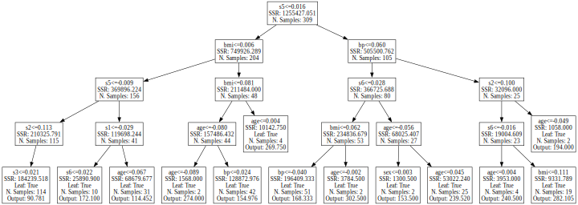
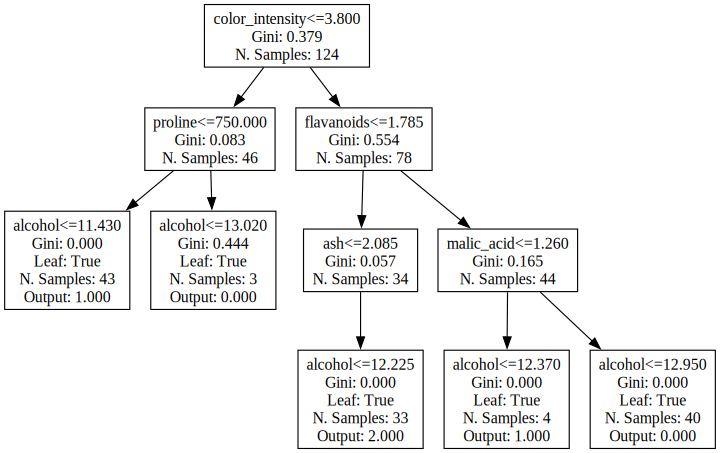
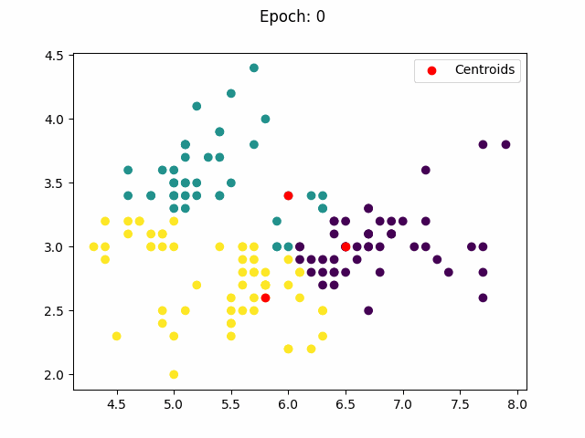

# rlearn
Learning machine learning algorithms.

# Table of Contents
- [Linear Models](#Linear-Models)  
    - [Binary Classification](#binary-classification)  
        - [Standard Perceptron](#standard-perceptron)  
        - [Logistic Regression](#perceptron-with-sigmoid-activation)
    - [Regression](#regression)  
        - [Ordinary Least Squares](#ordinary-least-squares)
        - [Linear Regression](#perceptron-with-linear-activation)
        - [Elastic Net](#elastic-net)
- [Neural Networks](#neural-networks)  
    - [Regression](#regression-with-neural-network)  
        - [Multilayer Perceptron](#multilayer-perceptron)
    - [Multiclass Classification](#multiclass-classification)  
        - [Multilayer Perceptron](#multilayer-perceptron-classification)
        - [Convolutional Neural Network](#convolutional-neural-network)  
- [Trees](#trees)
    - [Regression](#regression-with-trees)  
        - [Decision Tree](#decision-tree-regressor)  
        - [Random Forest](#random-forest-regressor)  
        - [Gradient Boosting Regressor](#gradient-boosting-regressor)
    - [Classification](#classification-with-trees)  
        - [Decision Tree](#decision-tree-classifier)
        - [Random Forest](#random-forest-classifier)
        - [Gradient Boosting Classifier](#gradient-boosting-classifier)
- [Clusters](#clusters)
    - [K-Means](#k-means)
- [Neighbors](#neighbours)  
    - [Classification](#classification-with-knn)  
        - [K-Nearest Neighbors](#k-nearest-neighbours-classifier)
    - [Regression](#regression-with-knn)
        - [K-Nearest Neighbors Regressor](#k-nearest-neighbours-regressor)

## [Linear Models](rlearn\linear_model.py)


```python
import matplotlib.pyplot as plt
import numpy as np
from rlearn.solvers import *
from sklearn.model_selection import train_test_split
from sklearn.metrics import f1_score, mean_squared_error, classification_report

np.set_printoptions(precision=2, suppress=1)
```

### Binary Classification

Dataset used for binary classification examples:


```python
from sklearn.datasets import load_breast_cancer

X, y = load_breast_cancer(return_X_y=True)
X_train, X_test, y_train, y_test = train_test_split(X, y, test_size=0.20, random_state=42)
```

#### Standard Perceptron


```python
from rlearn.linear_model import Perceptron
standard_perceptron = Perceptron(solver='perceptron', activation='step', loss_function='perceptron')
standard_perceptron.fit(X_train, y_train)

print(classification_report(y_test, standard_perceptron.predict(X_test)))
```

                  precision    recall  f1-score   support
    
               0       0.88      1.00      0.93        43
               1       1.00      0.92      0.96        71
    
        accuracy                           0.95       114
       macro avg       0.94      0.96      0.95       114
    weighted avg       0.95      0.95      0.95       114
    
    

#### Perceptron with  Sigmoid Activation
Which is equivalent to a Logistic Regression


```python
logistic_model = Perceptron(activation='sigmoid', loss_function='logloss')
logistic_model.fit(X_train, y_train)

print(classification_report(y_test, logistic_model.predict(X_test)))
```

                  precision    recall  f1-score   support
    
               0       1.00      0.81      0.90        43
               1       0.90      1.00      0.95        71
    
        accuracy                           0.93       114
       macro avg       0.95      0.91      0.92       114
    weighted avg       0.94      0.93      0.93       114
    
    

### Regression

Dataset used for regression examples


```python
from sklearn.datasets import load_diabetes
X, y = load_diabetes(return_X_y=True)
X_train, X_test, y_train, y_test = train_test_split(X, y, test_size=0.20, random_state=42)
```

#### Ordinary Least Squares


```python
from rlearn.linear_model import OLS

ols = OLS()
ols.fit(X_train, y_train)
print('Mean Squared Error:',mean_squared_error(y_test, ols.predict(X_test)))
```

    Mean Squared Error: 2900.1936284934795
    

#### Perceptron with Linear Activation
Which is equivalent to a simple Linear Regression


```python
linear_regression = Perceptron(activation='linear', 
                    solver=StochasticGradientDescent(learning_rate=0.1, momentum=0.9))
linear_regression.fit(X_train, y_train, epochs=100000)
print('Mean Squared Error:',mean_squared_error(y_test, linear_regression.predict(X_test)))
```

    Mean Squared Error: 2886.3682400969315
    

#### Elastic Net


```python
from rlearn.linear_model import ElasticNet
elastic_net = ElasticNet(alpha=1, l1_ratio=1, learning_rate=0.01, solver='sgd')
elastic_net.fit(X_train, y_train, verbose=0, epochs=100000)
print('Mean Squared Error:',mean_squared_error(y_test, elastic_net.predict(X_test)))
```

    Mean Squared Error: 2945.079897872204
    

## [Neural Networks](rlearn/nn.py)  
<sub>[Back to top.](#table-of-contents)</sub>


### Regression with Neural Network

#### Multilayer Perceptron


```python
from rlearn.nn import NNModel, FC
from rlearn.activation_functions import *
from rlearn.regularization import Regularization

mlp_regularization = NNModel(loss='mse', input_dim=X_train.shape[1:], layers=[
    FC(16, regularization=Regularization(alpha=1, l1_ratio=1)),
    FC(1, activation=Relu())
])

mlp_regularization.fit(X_train, y_train, X_test, y_test, epochs=50000, verbose=10000)
print('Mean Squared Error:',mean_squared_error(y_test, mlp_regularization.predict(X_test, 1)))
```

    Epoch 1: Training Loss 27955.21	Test Loss 26366.34
    Epoch 10000: Training Loss 2931.24	Test Loss 2783.92
    Epoch 20000: Training Loss 2790.74	Test Loss 2667.35
    Epoch 30000: Training Loss 2749.40	Test Loss 2628.80
    Epoch 40000: Training Loss 2710.99	Test Loss 2624.76
    Epoch 50000: Training Loss 2686.43	Test Loss 2617.87
    Mean Squared Error: 2617.8651642833656
    

### Multiclass Classification

Dataset used for multiclass classification


```python
from tensorflow.keras.datasets import fashion_mnist

(X_train, y_train), (X_test, y_test) = fashion_mnist.load_data()
X_train = X_train.reshape(*X_train.shape, 1)
X_test = X_test.reshape(*X_test.shape, 1)
X_train = X_train / 255
X_test = X_test / 255
```

#### Multilayer Perceptron Classification


```python
from rlearn.nn import Squeezing
mlp_regularization = NNModel(input_dim=X_train.shape[1:], layers=[
    Squeezing(),
    FC(30, regularization=Regularization(alpha=1, l1_ratio=0)),
    FC(10, activation=Softmax())
])

mlp_regularization.fit(X_train, y_train, X_test, y_test, epochs=10, verbose=2)
print(classification_report(y_test, mlp_regularization.predict(X_test)))
```

    Epoch 1: Training Loss 0.10	Training Accuracy 0.66	Test Loss 0.09	Test Accuracy 0.69
    Epoch 2: Training Loss 0.08	Training Accuracy 0.72	Test Loss 0.07	Test Accuracy 0.75
    Epoch 4: Training Loss 0.06	Training Accuracy 0.79	Test Loss 0.06	Test Accuracy 0.79
    Epoch 6: Training Loss 0.05	Training Accuracy 0.83	Test Loss 0.05	Test Accuracy 0.81
    Epoch 8: Training Loss 0.05	Training Accuracy 0.84	Test Loss 0.05	Test Accuracy 0.82
    Epoch 10: Training Loss 0.05	Training Accuracy 0.82	Test Loss 0.05	Test Accuracy 0.82
                  precision    recall  f1-score   support
    
               0       0.66      0.90      0.76      1000
               1       0.99      0.93      0.95      1000
               2       0.71      0.71      0.71      1000
               3       0.86      0.83      0.84      1000
               4       0.68      0.80      0.73      1000
               5       0.95      0.89      0.92      1000
               6       0.70      0.36      0.47      1000
               7       0.92      0.88      0.90      1000
               8       0.91      0.95      0.93      1000
               9       0.87      0.97      0.92      1000
    
        accuracy                           0.82     10000
       macro avg       0.82      0.82      0.81     10000
    weighted avg       0.82      0.82      0.81     10000
    
    

#### Convolutional Neural Network


```python
from rlearn.nn import Conv3C, MaxPooling

convnn_regularization = NNModel(input_dim=X_train.shape[1:], layers=[
    Conv3C(kernel_size=3, n_chanels_kernel=X_train.shape[-1], out_channels=8, 
           regularization=Regularization(1, 0)),
    MaxPooling(),
    Squeezing(),
    FC(10, activation=Softmax())
])

convnn_regularization.fit(X_train, y_train, X_test, y_test, epochs=10, verbose=2)
print(classification_report(y_test, convnn_regularization.predict(X_test)))
```

    Epoch 1: Training Loss 0.06	Training Accuracy 0.79	Test Loss 0.07	Test Accuracy 0.77
    Epoch 2: Training Loss 0.04	Training Accuracy 0.82	Test Loss 0.06	Test Accuracy 0.82
    Epoch 4: Training Loss 0.03	Training Accuracy 0.87	Test Loss 0.05	Test Accuracy 0.84
    Epoch 6: Training Loss 0.03	Training Accuracy 0.88	Test Loss 0.04	Test Accuracy 0.86
    Epoch 8: Training Loss 0.03	Training Accuracy 0.89	Test Loss 0.04	Test Accuracy 0.87
    Epoch 10: Training Loss 0.03	Training Accuracy 0.88	Test Loss 0.04	Test Accuracy 0.87
                  precision    recall  f1-score   support
    
               0       0.83      0.79      0.81      1000
               1       0.98      0.96      0.97      1000
               2       0.80      0.76      0.78      1000
               3       0.86      0.90      0.88      1000
               4       0.76      0.82      0.79      1000
               5       0.97      0.96      0.96      1000
               6       0.64      0.64      0.64      1000
               7       0.95      0.92      0.94      1000
               8       0.97      0.95      0.96      1000
               9       0.93      0.97      0.95      1000
    
        accuracy                           0.87     10000
       macro avg       0.87      0.87      0.87     10000
    weighted avg       0.87      0.87      0.87     10000
    
    

## [Trees](rlearn/tree.py)  
<sub>[Back to top.](#table-of-contents)</sub>

### Regression with Trees

Dataset used for Regression. My implementation of Decision Trees requires DataFrame as input.


```python
from rlearn.tree_utils import plot_tree

X, y = load_diabetes(return_X_y=True, as_frame=True)
split_delimiter = int(len(X)*0.7)
X_train = X[:split_delimiter]
y_train = y[:split_delimiter]
X_test = X[split_delimiter:]
y_test = y[split_delimiter:]
```

#### Decision Tree Regressor


```python
from rlearn.tree import DecisionTreeRegressor
dtr = DecisionTreeRegressor(max_depth=4, min_samples_split=20)
dtr.fit(X_train, y_train)

print('Mean Squared Error:',mean_squared_error(y_test, dtr.predict(X_test)))
```

    Mean Squared Error: 4193.494500508087
    


```python
plot_tree(dtr)
```


    

    


#### Random Forest Regressor


```python
from rlearn.tree import RandomForestRegressor

forest = RandomForestRegressor(max_depth=5, n_estimators=100, bootstrap_size=int(np.sqrt(len(X_train))))
forest.fit(X_train, y_train, X_test, y_test, verbose=20)

print('Mean Squared Error:',mean_squared_error(y_test, forest.predict(X_test)))
```

    Train Loss: 8889.730582524271	Test Loss: 9582.218045112782
    Train Loss: 3677.895300618629	Test Loss: 3677.89090807494
    Train Loss: 3468.3139892057757	Test Loss: 3295.6151943570385
    Train Loss: 3464.479212949313	Test Loss: 3291.0131511277013
    Train Loss: 3529.51256273258	Test Loss: 3343.131945322952
    Train Loss: 3483.868598453883	Test Loss: 3319.7515838969816
    Mean Squared Error: 3319.7515838969816
    

#### Gradient Boosting Regressor


```python
from rlearn.tree import GradientBoostRegressor

gbr = GradientBoostRegressor(max_depth=3, frac_of_samples=0.7, min_samples_split=20, max_features=4, n_estimators=30)
gbr.fit(X_train, y_train, X_test, y_test, verbose=10)

print('Mean Squared Error:',mean_squared_error(y_test, gbr.predict(X_test)))
```

    Estimators: 0	Train Loss: 5597.333015255618	Validation Loss: 5361.534188078531
    Estimators: 10	Train Loss: 3232.3129922014514	Validation Loss: 3594.923680029551
    Estimators: 20	Train Loss: 2263.3096834774647	Validation Loss: 3111.1424773070717
    Estimators: 29	Train Loss: 1921.760692829892	Validation Loss: 3079.7276552377384
    Mean Squared Error: 3060.172169586149
    

### Classification with Trees

Dataset used for classification with Trees.


```python
from sklearn.datasets import load_wine
from sklearn.model_selection import train_test_split

X, y = load_wine(return_X_y=True, as_frame=True)
X_train, X_test, y_train, y_test = train_test_split(X, y, test_size=0.3, shuffle=True)
```

#### Decision Tree Classifier


```python
from rlearn.tree import DecisionTreeClassifier
dtc = DecisionTreeClassifier(max_depth=4, min_samples_split=20)
dtc.fit(X_train, y_train)

print(classification_report(y_test, dtc.predict(X_test)))
```

                  precision    recall  f1-score   support
    
               0       0.74      1.00      0.85        17
               1       1.00      0.68      0.81        22
               2       0.94      1.00      0.97        15
    
        accuracy                           0.87        54
       macro avg       0.89      0.89      0.88        54
    weighted avg       0.90      0.87      0.87        54
    
    


```python
plot_tree(dtc)
```


    

    


#### Random Forest Classifier


```python
from rlearn.tree import RandomForestClassifier

forest = RandomForestClassifier(max_depth=5, n_estimators=200, bootstrap_size=int(np.sqrt(len(X_train))))
forest.fit(X_train, y_train, X_test, y_test, verbose=40)

print(classification_report(y_test, forest.predict(X_test)))
```

    Train Loss: 0.8790322580645161	Test Loss: 0.8333333333333334
    Train Loss: 0.9919354838709677	Test Loss: 0.9259259259259259
    Train Loss: 0.9838709677419355	Test Loss: 0.9629629629629629
    Train Loss: 0.9838709677419355	Test Loss: 0.9629629629629629
    Train Loss: 0.9838709677419355	Test Loss: 0.9629629629629629
    Train Loss: 0.9838709677419355	Test Loss: 0.9814814814814815
                  precision    recall  f1-score   support
    
               0       1.00      1.00      1.00        17
               1       1.00      0.95      0.98        22
               2       0.94      1.00      0.97        15
    
        accuracy                           0.98        54
       macro avg       0.98      0.98      0.98        54
    weighted avg       0.98      0.98      0.98        54
    
    

#### Gradient Boosting Classifier


```python
from rlearn.tree import GradientBoostClassifier

gbc = GradientBoostClassifier(n_estimators=200, max_depth=5, frac_of_samples=0.3, max_features=int(np.sqrt(X_train.shape[1])))
gbc.fit(X_train, y_train, X_test, y_test, verbose=40)

print(classification_report(y_test, gbc.predict(X_test)))
```

    Estimators: 0	Train Loss: 0.3709677419354839	Validation Loss: 0.46296296296296297
    Estimators: 40	Train Loss: 1.0	Validation Loss: 1.0
    Estimators: 80	Train Loss: 1.0	Validation Loss: 0.9629629629629629
    Estimators: 120	Train Loss: 1.0	Validation Loss: 0.9629629629629629
    Estimators: 160	Train Loss: 1.0	Validation Loss: 0.9814814814814815
    Estimators: 199	Train Loss: 1.0	Validation Loss: 0.9814814814814815
                  precision    recall  f1-score   support
    
               0       1.00      1.00      1.00        14
               1       1.00      1.00      1.00        25
               2       1.00      1.00      1.00        15
    
        accuracy                           1.00        54
       macro avg       1.00      1.00      1.00        54
    weighted avg       1.00      1.00      1.00        54
    
    

## [Clusters](rlearn/cluster.py)  
<sub>[Back to top.](#table-of-contents)</sub>

Dataset used for clustering.


```python
from sklearn.datasets import load_iris
X, y = load_iris(return_X_y=True)

```

#### K-Means


```python
from rlearn.cluster import KMeans

kmeans = KMeans(k=3)
kmeans.fit(X[:,[0,1]])
_ = kmeans.make_animation(X[:,[0,1]], interval=1000)
```



## [Neighbors](rlearn/neighbour.py)
<sub>[Back to top.](#table-of-contents)</sub>

### Classification with KNN

Dataset used for classification with neighbours algorithms.


```python
from sklearn.datasets import load_wine
X, y = load_wine(return_X_y=True)
X_train, X_test, y_train, y_test = train_test_split(X, y, test_size=0.20, random_state=42, shuffle=True)
```

#### K-Nearest Neighbours Classifier


```python
from rlearn.neighbour import KNearestNeighbors
knn = KNearestNeighbors(14)
knn.fit(X_train, y_train)
print(classification_report(y_test, knn.predict(X_test)))
```

                  precision    recall  f1-score   support
    
               0       0.88      1.00      0.93        14
               1       0.82      0.64      0.72        14
               2       0.44      0.50      0.47         8
    
        accuracy                           0.75        36
       macro avg       0.71      0.71      0.71        36
    weighted avg       0.76      0.75      0.75        36
    
    

### Regression with KNN

Dataset used for regression.


```python
from sklearn.datasets import fetch_california_housing
housing = fetch_california_housing()
X_train, X_test, y_train, y_test = train_test_split(housing.data, housing.target, test_size=0.20, random_state=42, shuffle=True)
```

#### K-Nearest Neighbours Regressor


```python
from rlearn.neighbour import KNearestNeighborsRegressor

knnr = KNearestNeighborsRegressor(10)
knnr.fit(X_train, y_train)
mean_squared_error(y_test, knnr.predict(X_test))
```


    0.25277777777777777


<sub>[Back to top.](#table-of-contents)</sub>
